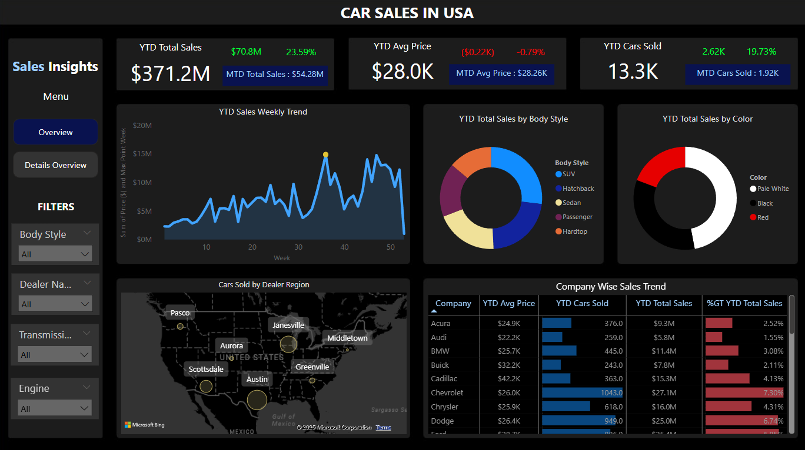
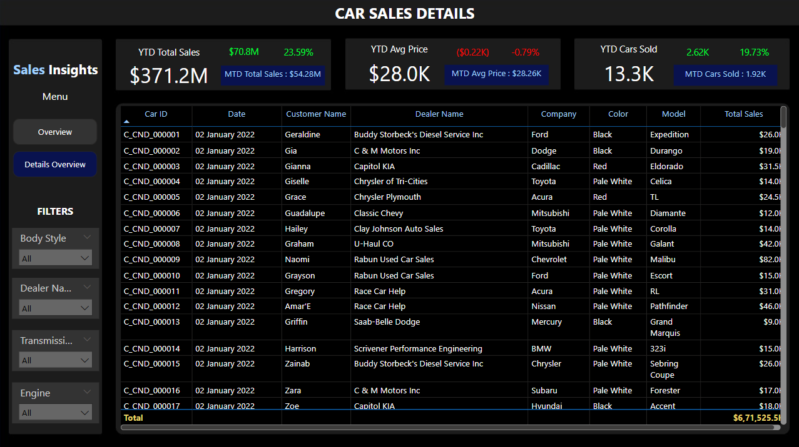

# Car Sales Power BI Dashboard

## Project Overview
This project presents an interactive Power BI dashboard designed to analyze car sales performance across various dimensions such as time, brand, body style, and dealer regions. The dashboard leverages advanced DAX measures to deliver real-time KPIs and actionable insights that can drive data-informed decision-making.

## Objective
The primary goal of this project is to create a dynamic Car Sales Dashboard that visualizes key performance indicators (KPIs) and sales trends, enabling the business to:
- Monitor sales performance over time.
- Track monthly and yearly growth.
- Identify high-performing car brands, body styles, and regions.
- Make data-driven sales decisions quickly.

## Key Features & Metrics

### KPI Tracking
- Sales Overview:
   - Year-to-Date (YTD) Total Sales
   - Month-to-Date (MTD) Total Sales
   - Year-over-Year (YOY) Growth
   - YTD vs Previous Year YTD (PTYD) Comparison
- Average Price Analysis:
   - YTD Average Price
   - MTD Average Price
   - YOY Growth in Average Price
   - YTD vs PTYD Average Price Difference
- Cars Sold Metrics:
   - YTD Cars Sold
   - MTD Cars Sold
   - YOY Growth in Cars Sold
   - YTD vs PTYD Cars Sold Difference

### Advanced DAX Measures
- YTD, MTD, YOY, and PTYD calculations for dynamic, time-based reporting.
- Percentage change calculations for real-time performance tracking.

## Visualizations

### Page 1: Sales Overview
- Interactive navigation menu for switching pages.
- Custom slicers: Body Style, Dealer Name, Transmission, Engine.
- KPIs Panel:
   - YTD Total Sales
   - Total Sales Difference and Percentage Growth
   - MTD Total Sales
   - YTD Average Price
   - Average Price Difference and Percentage Change
   - YTD Cars Sold with Growth Metrics and MTD Cars Sold
- Visuals:
   - Area Chart: YTD Sales Weekly Trend
   - Donut Chart: YTD Sales by Body Style
   - Donut Chart: YTD Sales by Color
   - Map Chart: Cars Sold by Dealer Region
   - Table: Company-Wise Sales Trend  

### Page 2: Detailed Overview
- KPIs Panel
- Detailed Table:
   - Car ID, Date, Customer Name, Dealer Name, Company, Color, Model, Total Sales.

## Tools Used
- Power BI Desktop
- DAX (Advanced measures for YTD, MTD, YOY, PTYD calculations)
- Excel (Dataset)

## Dataset Overview
| Column Name | Description |
|-------------|-------------|
| Car ID | Unique identifier for each car sale |
| Date | Date of the sale |
| Customer Name | Customer’s name |
| Gender | Customer’s gender |
| Annual Income | Customer’s annual income |
| Dealer Name | Name of the dealer |
| Company/Brand | Car brand |
| Model | Car model |
| Engine | Engine type |
| Transmission | Transmission type |
| Colour | Car color |
| Price | Sale price |
| Dealer Number | Dealer’s contact number |
| Body Style | Type of car body (e.g., SUV, Sedan) |
| Phone Number | Customer’s phone number |
| Dealer Region | Sales region |

## How to Explore the Dashboard
- Download the `.pbix` file from this repository.
- Open the file in Power BI Desktop to interact with the dashboard.
- Use the slicers and navigation menu to explore different views and drill down into details.

## Dashboard Snapshots
### Page 1: Sales Overview

### Page 2: Detailed Overview

## Contact
For any queries, feel free to reach out to me on:  
[Shaunak Torgatti](www.linkedin.com/in/shaunaktorgatti)
